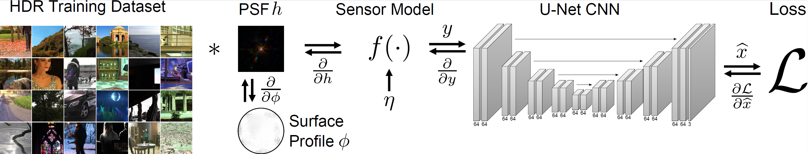

# Deep Optics for Single-shot High-dynamic-range Imaging
Code associated with the paper "Deep Optics for Single-shot High-dynamic-range Imaging" CVPR, 2020, by Chris Metzler, Hayato Ikoma, Yifan (Evan) Peng, and Gordon Wetzstein.

## Abstract
High-dynamic-range (HDR) imaging is crucial for many applications. Yet, acquiring HDR images with a single shot remains a challenging problem. Whereas modern deep learning approaches are successful at hallucinating plausible HDR content from a single low-dynamic-range (LDR) image, saturated scene details often cannot be faithfully recovered. Inspired by recent deep optical imaging approaches, we interpret this problem as jointly training an optical encoder and electronic decoder where the encoder is parameterized by the point spread function (PSF) of the lens, the bottleneck is the sensor with a limited dynamic range, and the decoder is a convolutional neural network (CNN). The lens surface is then jointly optimized with the CNN in a training phase; we fabricate this optimized optical element and attach it as a hardware add-on to a conventional camera during inference. In extensive simulations and with a physical prototype, we demonstrate that this end-to-end deep optical imaging approach to single-shot HDR imaging outperforms both purely CNN-based approaches and other PSF engineering approaches.

## Dependencies
All dependencies for the testing code can be installed by running "conda env create -f environment.yml".

The training code also requries that OpenCV is installed.

##Testing
To reconstruct the experimentally captured data using a pretrained model run `DemoScript.sh`. Results will be saved in the "Reconstructions" directory. 

##Training
Before training, first follow the instructions in the supplement of [A] to download several thousand HDR images from various sources. A small subset of this dataset can be downloaded by running webscraper.py in the "utils" directory. The downloaded HDR video files can be decimated by running "SaveEvery10thFrame.py". Be sure to backup the data before running this function.

Next compile the preprocessing function "virtualcamera.cpp" by running 
`gcc -Wall -lm -lstdc++ -lopencv_core -lopencv_imgproc -lopencv_imgcodecs virtualcamera.cpp -o virtualcamera`
 from the "virtualcamera" directory.

To train a network and optics end-to-end run `EndtoEndTrainingScript.sh`. One will need to modify the "--data_dir" argument to point to the location of the newly created dataset.

To fine-tune a network using the measured PSF run `FineTuneTrainingScript.sh`. One will again need to modify the "--data_dir" argument to point to the location of the newly created dataset.

Please direct questions to cmetzler@stanford.edu.

## Acknowledgements
This project heavily uses code adapted from [A], [B], and [C]. It also uses the various HDR datasets listed in the supplement of [A].

[A] Eilertsen, Gabriel, et al. "HDR image reconstruction from a single exposure using deep CNNs." ACM transactions on graphics (TOG) 36.6 (2017): 1-15.

[B] Sitzmann, Vincent, et al. "End-to-end optimization of optics and image processing for achromatic extended depth of field and super-resolution imaging." ACM Transactions on Graphics (TOG) 37.4 (2018): 1-13.

[C] Chang, Julie, and Gordon Wetzstein. "Deep optics for monocular depth estimation and 3d object detection." Proceedings of the IEEE International Conference on Computer Vision. 2019.

